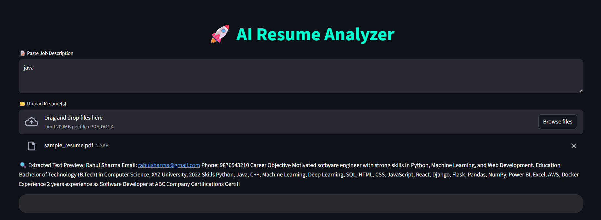
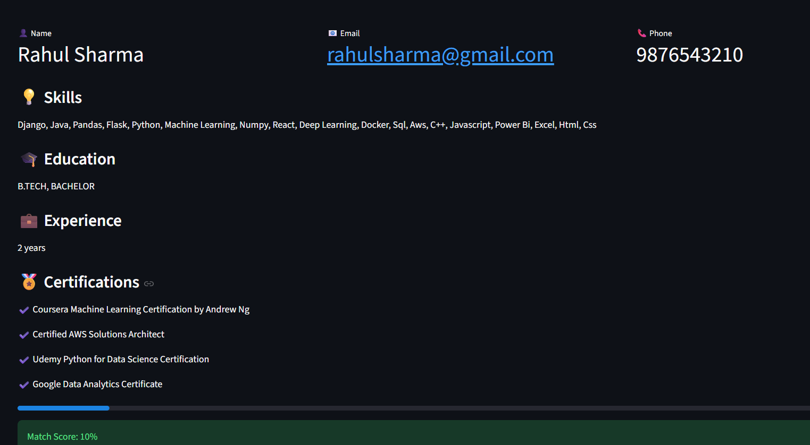

# AI Resume Analyzer
AI Resume Analyzer built using Python and Streamlit that extracts key information from resumes (PDF/DOCX) using NLP and OCR, and evaluates candidates with a job match score and visual insights. 

## Features

* Resume parsing for PDF and DOCX files
* OCR support for scanned resumes
* Extracts name, email, and phone number
* Identifies skills, education, and experience
* Detects certifications
* Calculates job match score based on job description
* Interactive web interface using Streamlit
* Visual comparison of candidates using charts

---

## Technologies Used

* Python
* Streamlit
* SpaCy (NLP)
* Pytesseract (OCR)
* Pandas
* Plotly

---

## How to Run

pip install -r requirements.txt  
python -m spacy download en_core_web_sm  
streamlit run app.py

---

## How It Works

The user uploads one or more resumes in PDF or DOCX format. The system extracts text using PDF parsing and OCR (for scanned documents). NLP techniques are used to identify key information such as skills, education, and experience.

If a job description is provided, the system compares extracted skills with the job requirements and calculates a match score. The results are displayed along with visual insights.

---

## Note

The job match score is calculated only when a job description is provided in the input field.

---

## Future Improvements

* Improve scoring using semantic similarity
* Add grammar and keyword analysis
* Enhance UI and user experience
* Support more file formats

---

## Author

Pritam Nayak
